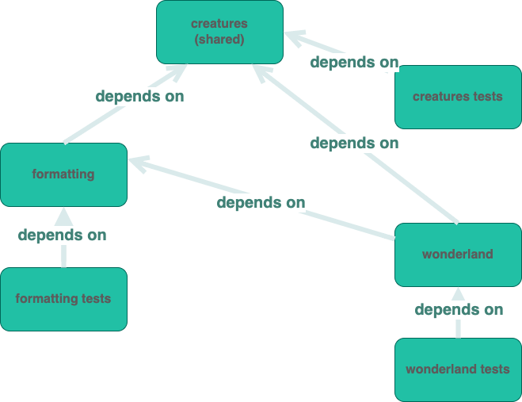

## Why 💡 - why is it important

Optimize your non-trivial TypeScript project size to `type-checking` the fastest possible for good development experience,
While making sure actions like `build` or `test` run faster with tools which use esbuild/webpack/babel that are **not** leveraging `TypeScript`, such as `ts-jest`, `ts-loader`, etc.

<!--truncate-->

## How 🤯 - how it will look like

[TypeScript project references][ts-project-references-link] allows you to break your project up into a number of smaller projects.
This improves compilation, improves `editors`' speed and reduces memory usage while working with `TypeScript` etc.

Using this feature, you will turn `TypeScript` from a simple transpiler into a smart build orchestrator.

## What 🤔 - what should I change?

Once configured, You will start running `tsc -b` <sub><sup>[1]</sup></sub> in your repository and it will build each project in the right order.

<br/>
<sub><sup>[1] - Build one or more projects and their dependencies, if out of date</sup></sub>
<br/>

### dist files vs src files referencing

Once built, projects will reference the built artifacts (the `.js` + `.d.ts` files) rather than the source (the `.ts` files) - i.e. reference the `/dist`, not the `/src`.
Essentially it allows TypeScript to treat our projects just like it treats `NPM` modules.
`.d.ts` files are much quicker for `TypeScript` to parse and understand than the `source code`.

---

## Introduction ✨

[TypeScript project references][ts-project-references-link] developed as a solution for non-trivial size projects, and as more projects move to [monorepo][nx-monorepo-explanation-link] it becomes common.

This article is covering the following subjects:

- Which configurations should be added, and how to use them with examples for everything
- Setup your project to be interoperable with other tools such as `webpack`, `jest`, `babel`, etc.
- How to use [TypeScript Path Mapping][ts-path-mapping-link] to setup [monorepo][nx-monorepo-explanation-link]s
- Using an [example project][example-repo-link] that shows how to use the project references setup

## Article Prerequisite 🔒

- Be familiar with the concept of `incremental` builds, and how it works in `TypeScript` for 'regular' setup (without project references).
  If you're not, I'm covering this subject on part 1 in this series **[TypeScript - Build Faster with Incremental Builds ⚡️](../incremental-builds.md)**.

## Issue 🦚 - Interoperability with other tools

The main struggle that exists with `TypeScript project references` is getting them working nicely with tools like `Jest`, `Webpack`, `ESbuild` etc for the same project.

I got to a conclusion that I want my `type-checking` to use project references, but builds and tests executions will follow [TypeScript path mapping][ts-path-mapping-link] and treat the whole project as a single project.

This allows to run the `TypeScript compiler` in `watch` mode with `incremental compilation`, giving fast feedback on type errors during development, then tools like `ESBuild` can parse `TypeScript` code without `type-checking` and compile my apps **really** fast. Same with `Jest`, it should just use `babel-jest` so the `TypeScript compiler` is not in the mix. Same with `webpack` either use `esbuild-loader` or `babel-loader`.

## The Solution 🛠

The TypeScript team introduced 2 suggestions to use project references.

1. Divide large logical parts into separate projects
2. Implement (1), plus separate the tests of each project into an independent project as well.

I wrote an example project that follows approach (2).
On the sections below I will overview the project, and explain the different configuration files and settings involved in making [TypeScript project references][ts-project-references-link] work well.

### Project Diagram



<!-- <details>
  <summary>File Structure</summary>
  <br/>
 <code ></code>
<br/>
</details> -->

### Project File Structure

```
// <link to repo>
.
├── tsconfig.json
├── tsconfig.base.json
├── tsconfig.project.json
├── tsconfig.test-project.json
├── package.json
├── node_modules
│   └── ...
├── src
│   ├── wonderland // DEPENDS ON: creatures, formatting
│   │   ├── initial-wonderland.ts
│   │   └── tsconfig.json
│   ├── creatures // DEPENDS ON: NONE
│   │   ├── cheshire-cat.creature.ts
│   │   ├── creature.interface.ts
│   │   ├── white-rabbit.creature.ts
│   │   ├── index.ts
│   │   └── tsconfig.json
│   └── formatting // DEPENDS ON: creatures
│       ├── format-how-creature-say-hello.ts
│       ├── tsconfig.test.json
│       └── tsconfig.json
├── build
│   ├── wonderland
│   │   ├── initial-wonderland.js
│   │   ├── initial-wonderland.d.ts
│   │   └── tsconfig.tsbuildinfo
│   ├── creatures
│   │   ├── cheshire-cat.creature.js
│   │   ├── cheshire-cat.creature.d.ts
│   │   ├── creature.interface.js
│   │   ├── creature.interface.d.ts
│   │   ├── white-rabbit.creature.js
│   │   ├── white-rabbit.creature.d.ts
│   │   ├── index.js
│   │   ├── index.d.ts
│   │   └── tsconfig.tsbuildinfo
│   ├── formatting
│   │    ├── format-how-creature-say-hello.js
│   │    ├── format-how-creature-say-hello.d.ts
│   │    └── tsconfig.tsbuildinfo
│   └── tests
│        ├── formatting
│        │     └── tsconfig.test.tsbuildinfo
│        ├── creatures
│        │      └── tsconfig.test.tsbuildinfo
│        ├── wonderland
│        │      └── tsconfig.test.tsbuildinfo
│        └── ...
│
└── ...
```

### 1. `tsconfig.json`

Create the root orchestrator `tsconfig.json`.

This config file is important for

1. Enabling to run `tsc -b` from the root dir to transpile and type-check all codes.
2. Enabling editor discover all projects.

The [disableSourceOfProjectReferenceRedirectis][ts-disable-source-of-project-reference-redirect-option-link] important, so your editor's [TypeScript language service][ts-language-service-link] does not ignore the project references and lose the performance gains you will put efforts to configure.
Using this option is good for performance but also it means that you have to run the typescript compiler in [watch mode][ts-watch-mode]<sub><sup>[1]</sup></sub> in the background so your code's output<sub><sup>[2]</sup></sub> is always up to date.

<sub><sup>[1] - watch mode means - typescript's watching input files. </sup></sub>
<sub><sup>[2] - Make sure you understand the difference between [dist files vs src file referencing](#dist-files-vs-src-files-referencing) </sup></sub>
<br/>

```json reference title="<rootDir>/tsconfig.json"
https://github.com/unicop-art/typescript-projects-references-example/blob/main/tsconfig.json
```

### 2. `tsconfig.base.json`

Define your basic configurations with `tsconfig.base.json`.

This file is the project's base `TypeScript` configuration which all projects (e.g. the `creatures` project) will use, and other tools will use it as well, so it should be setup to work with bundlers like `webpack`, testing frameworks like `jest` or runners like `ts-node`.

This file should be able to run smoothly for tools like `jest`, `webpack`, `ts-node`, etc.

```json reference title="<rootDir>/tsconfig.base.json"
https://github.com/unicop-art/typescript-projects-references-example/blob/main/tsconfig.base.json
```

### 3. `tsconfig.project.json`

Define your project references shared configurations with `tsconfig.project.json`.

This file is the baseline for projects references, by extending the `tsconfig.base.json`, which we leave as-is for the other tools mentioned above to use.

Also, because I'm going to configure tests as different projects, `tests files` are excluded.

So the `tsconfig.project.json` is well configured for our project references of `production-code` to use!

```json reference title="<rootDir>/tsconfig.project.json"
https://github.com/unicop-art/typescript-projects-references-example/blob/main/tsconfig.project.json
```

### 4. `tsconfig.test-project.json`

Define your test project references shared configurations with `tsconfig.test-project.json`.

This file is the baseline for `tests` project references only,

The same as in the `tsconfig.project.json`, we want to extend `tsconfig.base.json`, and `include` only our `test files`.

So the `tsconfig.test-project.json` is well configured for our `test-code` projects to use!

```json reference title="<rootDir>/tsconfig.test-project.json"
https://github.com/unicop-art/typescript-projects-references-example/blob/main/tsconfig.test-project.json
```

### 5. Referenced Project's `tsconfig.json`

Create the `tsconfig.json` that defines the referenced project.

Let's take the [formatting](#project-diagram) folder as an example

To turn the `formatting` folder into a `TypeScript` project, a `tsconfig.json` should be configured.

But we already configured everything for it, so it will be simple as

1. `extends` configurations from `tsconfig.project.json`
2. Specifying the `rootDir` and `outDir`
3. Add reference projects if needed
4. Add custom configurations if we like

See how it looks like

```json reference title="<rootDir>/src/formatting/tsconfig.json"
https://github.com/unicop-art/typescript-projects-references-example/blob/main/src/formatting/tsconfig.json
```

### 6. Referenced Test Project's `tsconfig.test.json`

Create the `tsconfig.test.json` that defines the referenced test project.

Continuing with the [formatting](#project-diagram) folder example.

To turn the `formatting tests project` to be `TypeScript` referenced project, we should define on the `formatting` folder a `tsconfig.test.json`.

Once again, we only need take into account:

1. `extends` configurations from `tsconfig.test-project.json`
2. Specifying the `rootDir` and `outDir`
3. Add reference projects if needed
4. Add custom configurations if we like

Worth mentioning that I configured `noEmit: true` in `tsconfig.test-project.json`, because I'm working with `jest`, which transpile the code for me with internal mechanism, so I should not be concerned about it.

To turn the `formatting` folder's `tests` to a `TypeScript` project, `tsconfig.test.json` should be configured on the top-level (of the `formatting` folder), and should `extends` the [tsconfig.test-project.json](#6-setup-test-code-project-example).

```json reference title="<rootDir>/src/formatting/tsconfig.test.json"
https://github.com/unicop-art/typescript-projects-references-example/blob/main/src/formatting/tsconfig.test.json
```

<!--
#### Example end-project `tsconfig.json` - `creatures`, `formatting`, and `wonderland` directories

```json reference title="<rootDir>/src/formatting/tsconfig.json"
https://github.com/unicop-art/typescript-projects-references-example/blob/main/src/formatting/tsconfig.json
```

```json reference title="<rootDir>/src/wonderland/tsconfig.json"
https://github.com/unicop-art/typescript-projects-references-example/blob/main/src/wonderland/tsconfig.json
``` -->

Dependency between project means that whenever TypeScript re-builds a file on the `formatting` he verifies that `creatures` project build is up-to-date, if not, TypeScript re-builds the `creatures` project before re-builds the `formatting`.

### 7 Create/update package.json for libraries

The `package.json` is important for `TypeScript` to know where the built versions of the code is (via the `main`, `module`, etc. options).
If your package is published to `NPM`, depending on your package manager and how you publish, this approach will be different.

This will allow you to have one main `entry` when working in the repo, but have a different setup when the package is published and consumed as a `3rd party library`.

```json
{
  "name": "@my-org/my-library",
  "version": "3.2.1",
  "main": "dist/index.js"
}
```

---

### 8. `monorepo` Extra Steps

#### Interoperability of monorepo and `tsconfig.base.json`

If you work with [monorepo][nx-monorepo-explanation-link], the `tsconfig.base.json` should also includes `Typescript` [path mapping][ts-path-mapping-link].

The [path mapping][ts-path-mapping-link] is important to let the different projects for other tools to find and resolve other packages.

```json reference title="<rootDir>/tsconfig.base.json"
https://github.com/unicop-art/typescript-projects-references-example/blob/main/tsconfig.base.json
```

To allow projects to reference each other, you need to add both the project reference for `tsc` in the project `tsconfig.json` and also add a `path mapping` in `tsconfig.base.json`.

Project `tsconfig.json`

```json
// <rootDir>/tsconfig.json
"references": [
    { "path": "../my-library" }
]
```

`<rootDir>/packages/my-package/package.json` - Only if this project is published to `NPM`

```json
// package.json
{
  "dependencies": {
    "@my-org/my-library": "0.0.1"
  }
}
```

Project `tsconfig.base.json`

```json
// <rootDir>/tsconfig.base.json
"paths": {
  "@my-org/my-library": "./lib/my-library/src/index.ts"
}
```

### 9. [Optional] TypeScript vs. Your Editor

TypeScript Project's added support for some advanced options that can help you gain better developing experience/speed-up your editor for specific cases, I will quickly overview the options that exists today.

1. [disableSourceOfProjectReferenceRedirectOption][ts-disable-source-of-project-reference-redirect-option-link] - this option I actually suggested to define on your [root tsconfig.json](#1-tsconfigjson) and explained what it does there.

2. [disableReferencedProjectLoad][ts-disable-referenced-project-load-option] - In multi-project TypeScript programs, your editor's TypeScript language service will load all of the available projects into memory in order to provide accurate results for editor responses which require a full knowledge graph like ‘Find All References’.
   Sometimes when dealing with extreme large project, you can use the flag disableReferencedProjectLoad to disable the automatic loading of all projects. Instead, projects are loaded dynamically as you open files through your editor.

3. [disableSolutionSearching][ts-disable-solution-searching-option] - Disable Solution Searching - When working with [composite][ts-composite-option-link] TypeScript projects, this option provides a way to declare that you do not want a project to be included when using features like find all references or jump to definition in an editor. This flag is something you can use to increase responsiveness in large composite projects.

## Note about Frontend Application setup 🗒

Now you have a good `TypeScript` setup, and you need to get your applications working.
Application setup is a too-big topic for the scope of this article, BUT according to what I mentioned above,
I would recommend you to use tool which **NOT use TypeScript** to avoid type-checking when not necessary, and simply resolve source files using path-mapping (not matter if through TypeScript path-mapping or in a different method), and not [TypeScript project references][ts-project-references-link].

By avoid type-checking and use path-mapping, you should expect your project to be resolved much faster, which gains a good development experience.

Some tools that work in these method are: `ESBuild`/`SWC`/`Babel`, etc. any tool that uses one of these under the hood should do the job at scale!

## Takeaway notes 🦄

- The `TypeScript project references` are hard and not intuitive to get working with the rest of the `JavaScript` cco-system.
- Avoid using `loaders` or `plugins` which use the `TypeScript compiler` internally like `ts-loader`, `ts-jest`, etc. They are great to get started with `TypeScript` but as the eco-system move into [monorepo][nx-monorepo-explanation-link]s which means larger single codebase, they slows us down.

## 🎖️ Credits

[Jake Ginnivan - Breaking down TypeScript project references](https://jakeginnivan.medium.com/breaking-down-typescript-project-references-260f77b95913) - His article inspired me writing this one. Also he shares some of his opinions and experience about the direction of the JS eco-system.

## 🔗 Sources

- [TypeScript Projects][ts-project-references-link]
- [TypeScript 3.4 - Releasing Projects][ts-3.4-release-note-link]
- [What monorepo is][nx-monorepo-explanation-link] - NX monorepo technology great site which explains and benchmark EVERYTHING.
- [TypeScript Performance Wiki - Using Project References][ts-performance-wiki-link] - An official Wiki the TypeScript team maintain in which they add recommendations how to help the TypeScript compiler to be better.
- [TypeScript Config References - Projects][ts-config-project-options-link] - All options available for project references

<!-- Links to specific pages -->

[ts-path-mapping-link]: https://www.typescriptlang.org/docs/handbook/release-notes/typescript-2-0.html#path-mapping
[ts-project-references-link]: https://www.typescriptlang.org/docs/handbook/project-references.html
[ts-config-project-options-link]: https://www.typescriptlang.org/tsconfig#Projects_6255
[example-repo-link]: https://github.com/unicop-art/typescript-projects-references-example/blob/main
[ts-3.4-release-note-link]: https://www.typescriptlang.org/docs/handbook/release-notes/typescript-3-4.html
[nx-monorepo-explanation-link]: https://monorepo.tools/
[ts-language-service-link]: https://github.com/microsoft/typescript/wiki/using-the-language-service-api

<!-- ts flags -->

[ts-incremental-option-link]: https://www.typescriptlang.org/tsconfig#incremental
[ts-composite-option-link]: https://www.typescriptlang.org/tsconfig#composite
[ts-tsbuildinfo-file-option-link]: https://www.typescriptlang.org/tsconfig#tsBuildInfoFile
[ts-performance-wiki-link]: https://github.com/microsoft/TypeScript/wiki/Performance#using-project-references
[ts-watch-mode]: https://www.typescriptlang.org/docs/handbook/configuring-watch.html
[ts-disable-source-of-project-reference-redirect-option-link]: https://www.typescriptlang.org/tsconfig#disableSourceOfProjectReferenceRedirect
[ts-disable-referenced-project-load-option]: https://www.typescriptlang.org/tsconfig#disableReferencedProjectLoad
[ts-disable-solution-searching-option]: https://www.typescriptlang.org/tsconfig#disableSolutionSearching
